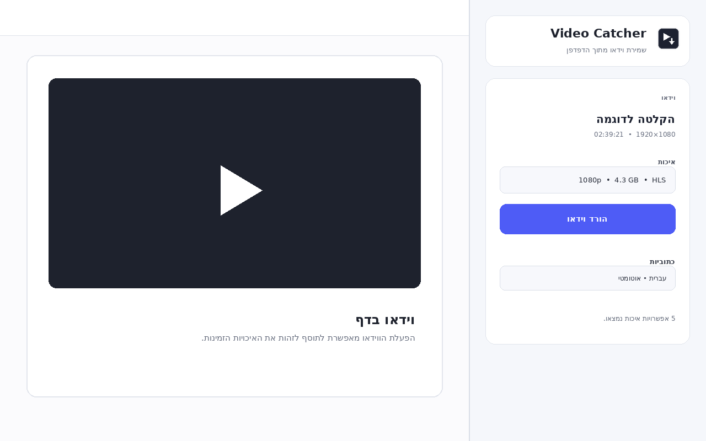
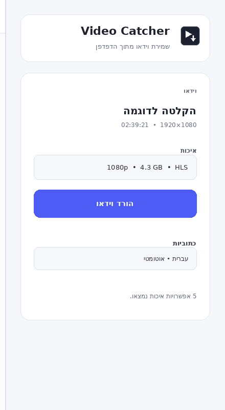

<p align="center">
  
</p>

<h1 align="center">Video Catcher</h1>

<p align="center" dir="rtl">
  תוסף Chrome לזיהוי ושמירת וידאו וכתוביות מתוך דפים נתמכים.
</p>

<h2 dir="rtl">מה התוסף עושה?</h2>

<p dir="rtl">
  <span dir="ltr">Video Catcher</span> מזהה זרמי וידאו שהדפדפן כבר טוען ומציג אותם בממשק צדדי פשוט. ניתן לבחור איכות, להוריד וידאו, להוריד כתוביות ולעקוב אחר התקדמות ההורדה.
</p>

<h3 dir="rtl">יכולות עיקריות</h3>

<ul dir="rtl">
  <li>זיהוי אוטומטי של זרמי <span dir="ltr">HLS</span> נתמכים</li>
  <li>בחירת איכות וידאו</li>
  <li>הצגת אומדן גודל לפני ההורדה</li>
  <li>הורדת וידאו ואודיו במקביל</li>
  <li>חיבור הווידאו והאודיו לקובץ אחד</li>
  <li><strong>הורדה מפוצלת</strong> לקבצים בגודל של עד <span dir="ltr">200MB</span></li>
  <li>הורדת כתוביות כקובץ נפרד</li>
  <li>זיהוי שפת כתוביות לפי התוכן במקרים שבהם המטא־דאטה שגוי</li>
  <li>אפשרות לבטל הורדה פעילה</li>
  <li>הצגה ברורה של הטאב וה־URL שנסרקים ואיפוס אוטומטי במעבר לדף אחר</li>
  <li>ממשק <span dir="ltr">Side Panel</span> מובנה בתוך Chrome</li>
  <li>קובץ <span dir="ltr">Debug</span> לצורך איתור תקלות</li>
  <li>ללא עקיפת <span dir="ltr">DRM</span></li>
</ul>

<p dir="rtl"><strong>שימו לב:</strong> נכון לגרסה הנוכחית, הרשאות האתרים של התוסף מוגבלות ל־<code dir="ltr">*.ac.il</code> ולשרתי המדיה הנדרשים לצורך ההורדה.</p>

<h2 dir="rtl">צילומי מסך</h2>

<p align="center">
  
</p>

<h3 dir="rtl">ממשק הצד</h3>

<p align="center">
  
</p>

<h2 dir="rtl">התקנה</h2>

<p dir="rtl">התוסף עדיין אינו מופץ דרך <span dir="ltr">Chrome Web Store</span>, ולכן יש להתקין אותו ידנית באמצעות מצב מפתח של Chrome.</p>

<h3 dir="rtl">1. הורדת התוסף</h3>

<ol dir="rtl">
  <li>פתח את עמוד <a href="https://github.com/WillyW0nka99/VideoCatcher/releases"><span dir="ltr">Releases</span></a> של הפרויקט.</li>
  <li>פתח את הגרסה שמסומנת <span dir="ltr"><strong>Latest</strong></span>.</li>
  <li>תחת <span dir="ltr"><strong>Assets</strong></span>, הורד את קובץ ה־<span dir="ltr">ZIP</span> של <span dir="ltr">Video Catcher</span>.</li>
  <li>חלץ את קובץ ה־<span dir="ltr">ZIP</span> לתיקייה קבועה במחשב. אין לנסות להתקין את התוסף ישירות מתוך קובץ ה־ZIP.</li>
</ol>

<h3 dir="rtl">2. הפעלת מצב מפתח ב־Chrome</h3>

<ol dir="rtl">
  <li>פתח לשונית חדשה ב־Chrome.</li>
  <li>בשורת הכתובת הקלד את הכתובת הבאה ולחץ Enter:</li>
</ol>

```text
chrome://extensions
```

<ol dir="rtl" start="3">
  <li>ייפתח עמוד <strong>ניהול התוספים</strong> של Chrome.</li>
  <li>בחלק העליון של העמוד חפש את המתג <span dir="ltr"><strong>Developer mode</strong></span> — בעברית הוא עשוי להופיע כ־<strong>מצב מפתח</strong>.</li>
  <li>העבר את המתג למצב פעיל. לאחר ההפעלה יופיעו בחלק העליון של העמוד כפתורים נוספים, ביניהם <span dir="ltr"><strong>Load unpacked</strong></span>.</li>
</ol>

<h3 dir="rtl">3. טעינת Video Catcher</h3>

<ol dir="rtl">
  <li>לחץ על <span dir="ltr"><strong>Load unpacked</strong></span> — בעברית הוא עשוי להופיע כ־<strong>טעינת תוסף שלא נארז</strong>.</li>
  <li>בחלון בחירת התיקייה, בחר את התיקייה שחילצת בשלב הראשון.</li>
  <li><strong>חשוב:</strong> יש לבחור את התיקייה שבה נמצא הקובץ <code dir="ltr">manifest.json</code> ישירות. אם <code dir="ltr">manifest.json</code> נמצא בתוך תיקיית משנה, היכנס אליה ובחר אותה.</li>
  <li>לאחר הבחירה, <span dir="ltr">Video Catcher</span> אמור להופיע ברשימת התוספים ולהיות פעיל.</li>
</ol>

<h3 dir="rtl">4. הצמדת התוסף לסרגל הכלים</h3>

<ol dir="rtl">
  <li>לחץ על סמל התוספים של Chrome ליד שורת הכתובת.</li>
  <li>מצא את <span dir="ltr">Video Catcher</span>.</li>
  <li>לחץ על סמל הנעץ כדי שהאייקון של התוסף יישאר גלוי בסרגל הכלים.</li>
</ol>

<p dir="rtl"><strong>חשוב:</strong> אל תמחק, תשנה את השם או תעביר את תיקיית התוסף לאחר ההתקנה. Chrome טוען את התוסף ישירות מהתיקייה הזאת.</p>

<h2 dir="rtl">שימוש</h2>

<ol dir="rtl">
  <li>פתח דף נתמך שמכיל וידאו.</li>
  <li>במידת הצורך, הפעל את הווידאו לכמה שניות כדי שמקור המדיה ייטען.</li>
  <li>לחץ על האייקון של <span dir="ltr"><strong>Video Catcher</strong></span>.</li>
  <li>ממשק ה־<span dir="ltr">Side Panel</span> ייפתח ויציג את הווידאו שזוהה.</li>
  <li>בחר איכות ולחץ על <strong>הורד וידאו</strong>.</li>
  <li>אם נמצאו כתוביות, ניתן להוריד אותן בנפרד מאזור הכתוביות.</li>
</ol>

<p dir="rtl">החלונית מציגה בחלק העליון את הטאב וה־URL שהיא סורקת. מעבר לטאב אחר או ניווט לדף אחר באותו טאב מעדכנים את ההקשר ומאפסים מצב ישן ששייך לעמוד הקודם.</p>

<p dir="rtl">במהלך הורדת <span dir="ltr">HLS</span> התוסף מוריד את ערוצי הווידאו והאודיו במקביל ומציג את ההתקדמות. ניתן לבטל את ההורדה בכל שלב.</p>

<h2 dir="rtl">הורדה מפוצלת</h2>

<p dir="rtl">
  כאשר האפשרות <strong>הורדה מפוצלת</strong> פעילה, <span dir="ltr">Video Catcher</span> מחלק במידת הצורך סרטון גדול למספר קבצים עצמאיים, כאשר כל חלק נשאר מתחת למגבלת <span dir="ltr">200MB</span>. מצב זה נועד להקל על העלאת סרטונים לשירותים שמגבילים את גודל הקובץ, למשל <span dir="ltr">NotebookLM</span> וכלי <span dir="ltr">AI</span> נוספים.
</p>

<ul dir="rtl">
  <li>הפיצול מתבצע בגבולות תקינים של מקטעי המדיה ולא בחיתוך שרירותי של הקובץ.</li>
  <li>כל חלק מקבל מידע פתיחה משלו כדי שיוכל לשמש כקובץ וידאו עצמאי.</li>
  <li>כל קובץ <span dir="ltr">MP4</span> מפוצל מדווח על משך הזמן האמיתי של אותו חלק.</li>
  <li>התוסף משתמש בפועל בתקרה מעט נמוכה מ־<span dir="ltr">200MB</span> כדי להשאיר מרווח ביטחון.</li>
  <li>שמות הקבצים מסודרים לפי הסדר, לדוגמה: <code dir="ltr">part-01-of-03</code>.</li>
  <li>אם הסרטון קטן מספיק, יישמר קובץ אחד בלבד גם כאשר האפשרות מסומנת.</li>
  <li>בגרסה הנוכחית, מצב הפיצול דורש מקור <span dir="ltr">HLS</span> מתאים. כאשר קיימים גם <span dir="ltr">MP4</span> וגם <span dir="ltr">HLS</span> לאותה איכות, התוסף משתמש אוטומטית ב־<span dir="ltr">HLS</span> לצורך הפיצול.</li>
</ul>

<h2 dir="rtl">לא זוהה וידאו?</h2>

<ol dir="rtl">
  <li>רענן את הדף.</li>
  <li>הפעל את הווידאו לכמה שניות.</li>
  <li>סגור ופתח מחדש את ה־<span dir="ltr">Side Panel</span>.</li>
  <li>ודא שהאתר נמצא בטווח האתרים שבהם התוסף מורשה לפעול.</li>
</ol>

<p dir="rtl">אם עדיין קיימת בעיה, פתח <strong>פרטים טכניים</strong> בתוסף והורד את קובץ ה־<span dir="ltr">Debug</span>.</p>

<h3 dir="rtl">דיווח על תקלה</h3>

<p dir="rtl">אם פתחת <span dir="ltr">Issue</span> ב־GitHub, מומלץ לצרף:</p>

<ul dir="rtl">
  <li>תיאור קצר של מה ניסית לעשות</li>
  <li>מה ציפית שיקרה ומה קרה בפועל</li>
  <li>גרסת Chrome</li>
  <li>גרסת <span dir="ltr">Video Catcher</span></li>
  <li>קובץ ה־<span dir="ltr">Debug</span> מתוך <strong>פרטים טכניים → הורד Debug</strong></li>
</ul>

<p dir="rtl">קובץ ה־<span dir="ltr">Debug</span> מצנזר חתימות וטוקנים רגישים, אך עדיין מומלץ לעבור עליו לפני פרסום פומבי.</p>

<p dir="rtl"><a href="https://github.com/WillyW0nka99/VideoCatcher/issues/new">פתיחת תקלה חדשה ב־GitHub</a></p>

<h2 dir="rtl">עדכון לגרסה חדשה</h2>

<ol dir="rtl">
  <li>החלף את קבצי התוסף הישנים בקבצים החדשים, או חלץ את הגרסה לתיקייה חדשה.</li>
  <li>פתח את <code dir="ltr">chrome://extensions</code>.</li>
  <li>לחץ על <span dir="ltr"><strong>Reload</strong></span> בכרטיס של <span dir="ltr">Video Catcher</span>.</li>
</ol>

<p dir="rtl">אם השתמשת בתיקייה חדשה, הסר את הגרסה הישנה וטען מחדש באמצעות <span dir="ltr"><strong>Load unpacked</strong></span>.</p>

<h2 dir="rtl">מגבלות</h2>

<ul dir="rtl">
  <li>התוסף אינו עוקף <span dir="ltr">DRM</span> או מנגנוני הגנת תוכן.</li>
  <li>לא כל אתר או פורמט וידאו נתמכים.</li>
  <li>כתובות מדיה חתומות עשויות לפוג לאחר זמן מסוים; במקרה כזה יש לרענן את הדף ולזהות את הווידאו מחדש.</li>
  <li>הורדות ארוכות או באיכות גבוהה עשויות להשתמש בכמות משמעותית של זיכרון בזמן עיבוד הקובץ.</li>
</ul>

<h2 dir="rtl">פרטיות</h2>

<p dir="rtl"><span dir="ltr">Video Catcher</span> פועל מקומית בדפדפן. מידע טכני שנאסף לצורך זיהוי מדיה ו־<span dir="ltr">Debug</span> אינו נשלח על ידי התוסף לשרת חיצוני.</p>

<h2 dir="rtl">אחריות וזכויות יוצרים</h2>

<p dir="rtl">השימוש בתוסף הוא באחריות המשתמש בלבד ובכפוף לתנאי השימוש של האתר בו אתם גולשים. ייתכן שהתכנים מוגנים בזכויות יוצרים. אין להעתיק, להפיץ או לשתף תוכן ללא הרשאה מתאימה מבעל הזכויות.</p>

<h2 dir="rtl">רישיון</h2>

<p dir="rtl">הפרויקט מופץ תחת רישיון <span dir="ltr">MIT</span>. ראו <a href="LICENSE"><span dir="ltr">LICENSE</span></a>.</p>

<hr>

<p dir="rtl"><strong>גרסה נוכחית:</strong> <code dir="ltr">v0.7.0</code></p>